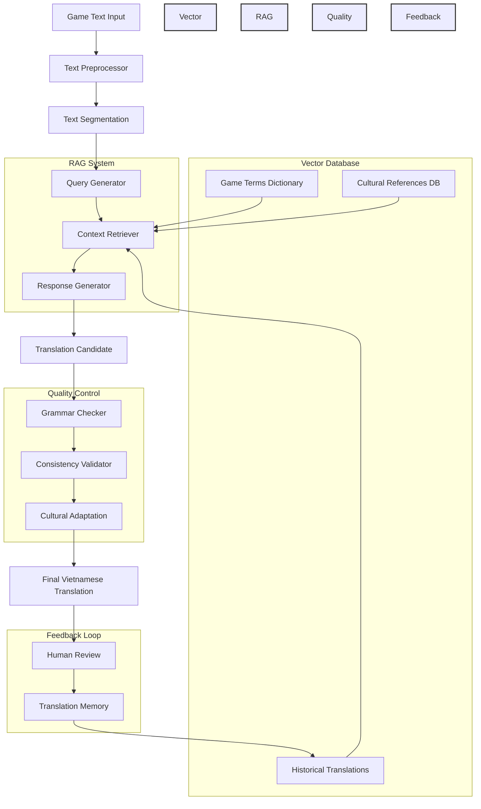

# Build AI Agent for Translation

```mermaid
graph TD
A[Game Text Input] --> B[Text Preprocessor]
B --> C[Text Segmentation]

subgraph Vector Database
D[Historical Translations]
E[Game Terms Dictionary]
F[Cultural References DB]
end

subgraph RAG System
G[Query Generator]
H[Context Retriever]
I[Response Generator]
end

C --> G
G --> H
H --> I

D --> H
E --> H
F --> H

I --> J[Translation Candidate]

subgraph Quality Control
K[Grammar Checker]
L[Consistency Validator]
M[Cultural Adaptation]
end

J --> K
K --> L
L --> M

M --> N[Final Vietnamese Translation]

subgraph Feedback Loop
O[Human Review]
P[Translation Memory]
end

N --> O
O --> P
P --> D

style Vector Database fill:#f9f,stroke:#333,stroke-width:2px
style RAG System fill:#bbf,stroke:#333,stroke-width:2px
style Quality Control fill:#bfb,stroke:#333,stroke-width:2px
style Feedback Loop fill:#ffb,stroke:#333,stroke-width:2px
```

